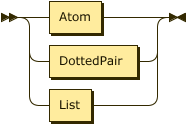
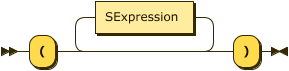
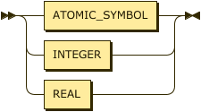
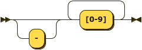
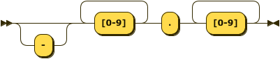

# MyLisp
これは言語処理系を作るというチャレンジのために作ったLispインタプリタである。
- 字句解析はflex(lex)
- 構文解析はBison(yacc)
- 意味解析はC言語
で作られている。

## Lispとは
[John McCarthy(Wiki)](https://ja.wikipedia.org/wiki/%E3%82%B8%E3%83%A7%E3%83%B3%E3%83%BB%E3%83%9E%E3%83%83%E3%82%AB%E3%83%BC%E3%82%B7%E3%83%BC)が開発したプログラミング言語であり、Lispの名前の由来であるlist processorの通り、プログラムとデータの両方をリストとして記述することができる強力な言語である。

[LISP(Wiki)](https://ja.wikipedia.org/wiki/LISP)

## 言語仕様
アトム

アトムには以下のものがある
- 記号
- 数
- t
- nil

記号は`x`, `atom`など、普通に文字を書いたもので、あらゆる文字を扱うことができる。<br>
使うことのできない文字は正規表現で`[ \t\r\n().#]`これらの文字である。<br>
数は1, 2, 1.0, 0,1などである。<br>
数字で始まっても数として扱えないもの(123ab等)は記号として扱われる。<br>
tは真偽値のtrueを表す特殊なアトムで、nilは空のリストや何もないことを表す特殊なアトムである。

リスト

リストは`(`で始まり`)`で終わる記法で表すことができる。<br>
ドットペアは`(X . Y)`のように表され、carがX, cdrがYとなる。<br>
ドットペアの特殊な形がリストで、ドットペアがネストし、cdrを辿り続けた時にもっとも深い位置にあるドットペアのcdrがnilだった場合、リストとなる。

例: `(1 . (2 . (3 . nil)))`

この例は`(1 2 3)`と同じ意味を持ち、同じリストとして扱われる。<br>
空のリストは`()`と表すことができ、これはアトムであるnilと同じ意味を持つ。

プログラムは`(+ 1 2 3)`のように一つ目に関数、それ以降に引数列の形のリスト構造をインタプリタに食わせることで評価させて実行することができる。


## システム関数
### SUBR

#### atom
(atom X)

Xがatomであればt、そうでなければnilを返す

```
(atom 1)
# -> t
(atom 1.1)
# -> t
(atom (quote a))
# -> t
(atom nil)
# -> t
(atom (quote (1 2)))
# -> nil
```


#### car
(car X)

cons(X)のcarを返す

```
(car (quote (1 2 3)))
# -> 1
```


#### cdr
(cdr X)

cons(X)のcdrを返す

```
(cdr (quote (1 2 3)))
# -> (2 3)
```


#### cons
(cons X Y)

XとYをそれぞれconsのcarとcdrにして返す

```
(cons (quote (1 2 3)) (quote (4 5 6)))
# -> ((1 2 3) 4 5 6)
```


#### eq
(eq X Y)

XとYが同値であればt、そうでなければnilを返す

```
(eq 1 1)
# -> t
(eq 1.1 1.1)
# -> t
(eq (quote a) (quote a))
# -> t
(eq (quote (1 2)) (quote (1 2)))
# -> t
(eq 1 2)
# -> nil
(eq (quote (1 2)) (quote (1 3)))
# -> nil
```


#### eval
(eval X)

MyLispの処理系と同じようにXを評価する

```
(eval 1)
# -> 1
(eval (quote ((lambda (x y) (+ x y)) 1 2)))
# -> 3
```


#### numberp
(numberp X)

Xがnumberであればt、そうでなければnilを返す

```
(numberp 1)
# -> t
(numberp 1.1)
# -> t
(numberp nil)
# -> nil
(numberp (quote a))
# -> nil
```


#### print
(print X)

Xを標準出力に書き出し、それ自体を返す

```
(print 1)
# 1
# -> 1
(print (quote a))
# a
# -> a
```


#### FSUBR

#### +
(+ X1 X2 X3 ... Xn)

X1, X2, X3, ... Xnを順次足し合わせて返す<br>
値はC言語のdoubleの計算精度、範囲である

```
(+ 1 2 3)
# -> 6
```


#### -
(- X1 X2 X3 ... Xn)

X1からX2, X3, ... Xnを順次引いて返す<br>
値はC言語のdoubleの計算精度、範囲である

```
(- 1 2 3)
# -> -4
```


#### *
(* X1 X2 X3 ... Xn)

X1, X2, X3, ... Xnを順次掛けて合わせて返す<br>
値はC言語のdoubleの計算精度、範囲である

```
(* 1 2 3)
# -> 6
```


#### /
(/ X1 X2 X3 ... Xn)

X1からX2, X3, ... Xnを順次割って返す<br>
値はC言語のdoubleの計算精度、範囲である

```
(/ 1 2 3)
# -> 0.166667 = 1 / 6
```


#### %
未実装<br>
モジュロ演算を順次実行する関数になる予定


#### cond
(cond (X1 Y11 Y12 ... Y1n) ... (Xn Yn1 Yn2 ... Ynn))

x1 ... Xnがtと評価されるまで引数を順に確認し、<br>
tと評価されたリストのYn1, Yn2 ... Ynnを評価し、最終の評価値を返す

```
(cond ((eq 1 2) (print 1)) ((eq 2 2) (print 2)) (t (print 3)))
# 2
# -> 2
(cond ((eq 1 2) (print 1)) ((eq 2 3) (print 2)) (t (print 3)))
# 3
# -> 3
```


#### define
(define X Y)

Xで指定されたatomにYをバインドする

```
(define x 1)
# -> x
# x = 1
(define x (quote (1 2 3)))
# -> x
# x = (1 2 3)
```


#### defun
未実装<br>
どのスコープからでもアクセスできる関数を定義できる関数になる予定


#### quote
(quote X)

Xを評価せずにそのまま返す

```
(quote a)
# -> a
(quote (1 2 3))
# -> (1 2 3)
```


#### lambdaの扱い
lambdaを関数として扱うことができる<br>
nlambdaで特殊形の関数を扱うことができ、引数が評価されない可変長引数のlambdaを定義できる

```
((lambda (x y) (+ x y)) 1 2)
# -> 3
((nlambda (x) (+ (car x) (car (cdr x)))) 1 2)
# -> 3
```

lambdaをatomにバインドして関数として呼び出すこともできる

```
(define func (quote (lambda (x y) (+ x y))))
# -> func
# func = (lambda (x y) (+ x y))
(func 1 2)
# -> 3
```

## BNF
[Railroad Diagram Generator](http://www.bottlecaps.de/rr/ui)をお借りしてBNFから図形を生成

```
Program ::= SExpression+
SExpression ::= (Atom | DottedPair | List)
List ::= "(" SExpression* ")"
DottedPair ::= "(" SExpression "." SExpression ")"
Atom ::= (ATOMIC_SYMBOL | INTEGER | REAL)
ATOMIC_SYMBOL ::= "[^ \t\r\n().#]"*
INTEGER ::= "-"? "[0-9]"+
REAL ::= "-"? "[0-9]"+ "." "[0-9]"+
```

### Program:


`Program ::= SExpression+`

### SExpression:



`SExpression ::= (Atom | DottedPair | List)`


### List:



`List ::= "(" SExpression* ")"`


### DottedPair:


`DottedPair ::= "(" SExpression "." SExpression ")"`


### Atom:



`Atom ::= (ATOMIC_SYMBOL | INTEGER | REAL)`


### ATOMIC_SYMBOL:


`ATOMIC_SYMBOL ::= "[^ \t\r\n().#]"*`


### INTEGER:



`INTEGER ::= "-"? "[0-9]"+`


### REAL:



`REAL ::= "-"? "[0-9]"+ "." "[0-9]"+`
